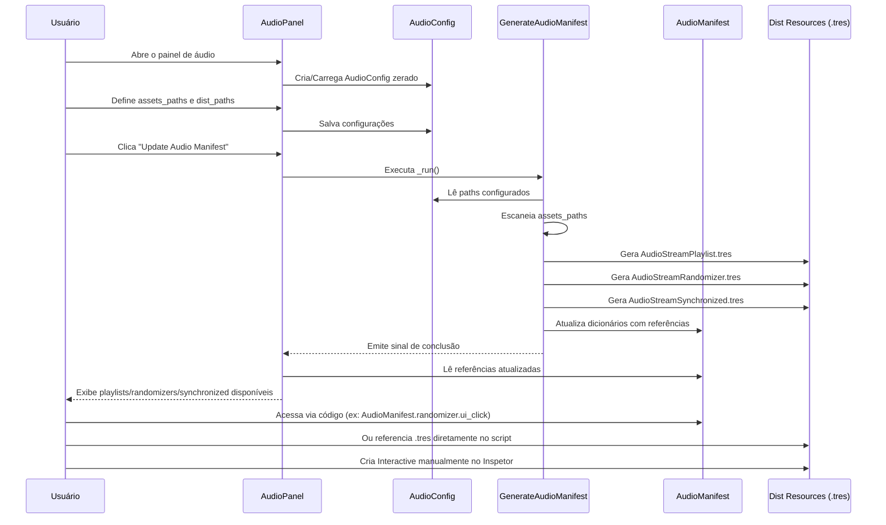

# Diagrama de Sequência do AudioCafe

Este diagrama de sequência ilustra a interação temporal entre os principais componentes do plugin AudioCafe, desde a abertura do painel até o acesso aos recursos de áudio pelo usuário.

## Descrição Detalhada da Sequência

1.  **Usuário Abre o Painel de Áudio**: O usuário interage com o editor Godot para abrir a interface do plugin AudioCafe.

2.  **`AudioPanel` Cria/Carrega `AudioConfig`**: O `AudioPanel` (instância de `audio_panel.gd`) verifica a existência do `audio_config.tres`. Se não existir, ele cria uma nova instância de `AudioConfig` e a salva. Caso contrário, carrega a existente.

3.  **Usuário Define Caminhos**: O usuário insere ou seleciona os caminhos para os assets de áudio (`assets_paths`) e o diretório de distribuição (`dist_paths`) na interface do `AudioPanel`.

4.  **`AudioPanel` Salva Configurações**: As configurações definidas pelo usuário são salvas no `audio_config.tres` através do `AudioPanel`.

5.  **Usuário Clica "Update Audio Manifest"**: O usuário inicia o processo de geração do manifesto clicando no botão correspondente no `AudioPanel`.

6.  **`AudioPanel` Executa `GenerateAudioManifest._run()`**: O `AudioPanel` invoca o método `_run()` do script `GenerateAudioManifest`.

7.  **`GenerateAudioManifest` Lê Configurações**: O `GenerateAudioManifest` acessa o `AudioConfig` para obter os caminhos configurados e as flags de geração.

8.  **`GenerateAudioManifest` Escaneia `assets_paths`**: O `GenerateAudioManifest` percorre recursivamente os diretórios especificados em `assets_paths` em busca de arquivos de áudio (`.ogg`, `.wav`).

9.  **`GenerateAudioManifest` Gera Recursos no `Dist Resources`**: Com base nos arquivos de áudio encontrados e nas configurações, o `GenerateAudioManifest` cria e salva os recursos `.tres` correspondentes (`AudioStreamPlaylist.tres`, `AudioStreamRandomizer.tres`, `AudioStreamSynchronized.tres`) no diretório de distribuição (`dist_paths`).

10. **`GenerateAudioManifest` Atualiza `AudioManifest`**: O `GenerateAudioManifest` preenche os dicionários do `AudioManifest` com as referências (caminho, contagem, UID) para os recursos de áudio recém-gerados e para quaisquer `AudioStreamInteractive` existentes que foram coletados.

11. **`GenerateAudioManifest` Emite Sinal de Conclusão**: Após a conclusão do processo de geração, o `GenerateAudioManifest` emite um sinal (`generation_finished`) para notificar o `AudioPanel`.

12. **`AudioPanel` Lê `AudioManifest` Atualizado**: O `AudioPanel` recebe o sinal e recarrega o `audio_manifest.tres` para obter as informações mais recentes.

13. **`AudioPanel` Exibe Recursos Disponíveis ao Usuário**: O `AudioPanel` atualiza sua interface para mostrar ao usuário a lista de playlists, randomizers e synchronized streams que foram gerados e estão disponíveis.

14. **Usuário Acessa `AudioManifest` Via Código**: Em tempo de execução, o código do jogo pode carregar o `audio_manifest.tres` e usar suas propriedades para acessar os caminhos dos recursos de áudio desejados (ex: `audio_manifest.randomizer.ui_click`).

15. **Usuário Referencia `.tres` Diretamente**: Alternativamente, o usuário pode referenciar um `.tres` de áudio diretamente em um script ou cena, embora o acesso via manifesto seja geralmente mais organizado.

16. **Usuário Cria `Interactive` Manualmente**: O usuário pode criar recursos `AudioStreamInteractive.tres` diretamente no editor Godot, configurando-os conforme necessário. Estes serão coletados pelo `GenerateAudioManifest` na próxima execução.