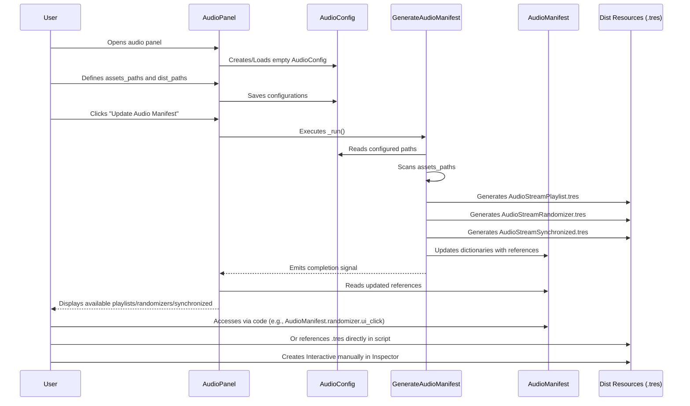

# AudioCafe Sequence Diagram

This sequence diagram illustrates the temporal interaction between the main components of the AudioCafe plugin, from opening the panel to the user's access to audio resources.

## Detailed Sequence Description

1.  **User Opens Audio Panel**: The user interacts with the Godot editor to open the AudioCafe plugin interface.

2.  **`AudioPanel` Creates/Loads `AudioConfig`**: The `AudioPanel` (instance of `audio_panel.gd`) checks for the existence of `audio_config.tres`. If it doesn't exist, it creates a new `AudioConfig` instance and saves it. Otherwise, it loads the existing one.

3.  **User Defines Paths**: The user enters or selects the paths for audio assets (`assets_paths`) and the distribution directory (`dist_paths`) in the `AudioPanel` interface.

4.  **`AudioPanel` Saves Configurations**: The configurations defined by the user are saved to `audio_config.tres` via the `AudioPanel`.

5.  **User Clicks "Update Audio Manifest"**: The user initiates the manifest generation process by clicking the corresponding button in the `AudioPanel`.

6.  **`AudioPanel` Executes `GenerateAudioManifest._run()`**: The `AudioPanel` invokes the `_run()` method of the `GenerateAudioManifest` script.

7.  **`GenerateAudioManifest` Reads Configurations**: The `GenerateAudioManifest` accesses the `AudioConfig` to obtain the configured paths and generation flags.

8.  **`GenerateAudioManifest` Scans `assets_paths`**: The `GenerateAudioManifest` recursively traverses the directories specified in `assets_paths` in search of audio files (`.ogg`, `.wav`).

9.  **`GenerateAudioManifest` Generates Resources in `Dist Resources`**: Based on the found audio files and configurations, the `GenerateAudioManifest` creates and saves the corresponding `.tres` resources (`AudioStreamPlaylist.tres`, `AudioStreamRandomizer.tres`, `AudioStreamSynchronized.tres`) in the distribution directory (`dist_paths`).

10. **`GenerateAudioManifest` Updates `AudioManifest`**: The `GenerateAudioManifest` populates the `AudioManifest` dictionaries with references (path, count, UID) to the newly generated audio resources and to any existing `AudioStreamInteractive`s that were collected.

11. **`GenerateAudioManifest` Emits Completion Signal**: After the generation process is complete, the `GenerateAudioManifest` emits a signal (`generation_finished`) to notify the `AudioPanel`.

12. **`AudioPanel` Reads Updated `AudioManifest`**: The `AudioPanel` receives the signal and reloads `audio_manifest.tres` to get the latest information.

13. **`AudioPanel` Displays Available Resources to User**: The `AudioPanel` updates its interface to show the user the list of playlists, randomizers, and synchronized streams that have been generated and are available.

14. **User Accesses `AudioManifest` Via Code**: At runtime, the game code can load `audio_manifest.tres` and use its properties to access the paths of the desired audio resources (e.g., `audio_manifest.randomizer.ui_click`).

15. **User References `.tres` Directly**: Alternatively, the user can reference a `.tres` audio file directly in a script or scene, although access via the manifest is generally more organized.

16. **User Creates `Interactive` Manually**: The user can create `AudioStreamInteractive.tres` resources directly in the Godot editor, configuring them as needed. These will be collected by `GenerateAudioManifest` on the next run.